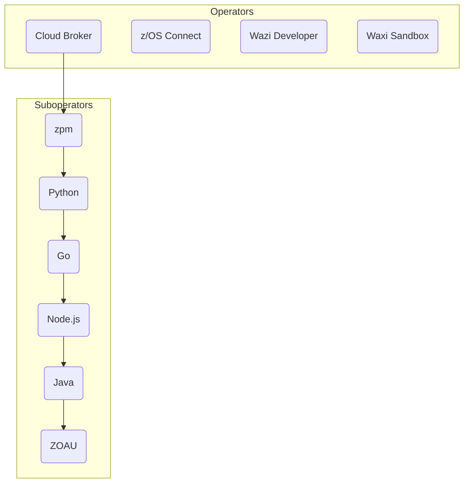

```mermaid
  graph TD;
    subgraph Operators
      CB(Cloud Broker)
      zCEE(z/OS Connect)
      Dev(Wazi Developer)
      Sandbox(Waxi Sandbox)
    end

    subgraph Suboperators   
      zpm(zpm)
      python(Python)
      go(Go)
      node(Node.js)
      Java(Java)
      ZOAU(ZOAU)
      
      zpm --> python --> go --> node --> Java --> ZOAU
    end
    
    CB --> zpm
     
```
