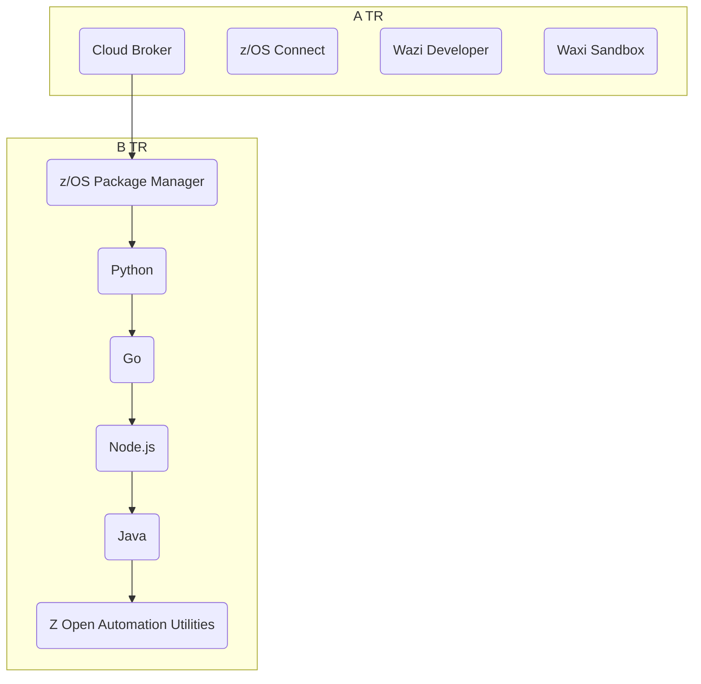

```mermaid
  graph TD;
    subgraph A TR
      CB(Cloud Broker)
      zCEE(z/OS Connect)
      Dev(Wazi Developer)
      Sandbox(Waxi Sandbox)
    end
    
    subgraph B TR
      zpm(z/OS Package Manager)
      python(Python)
      go(Go)
      node(Node.js)
      Java(Java)
      ZOAU(Z Open Automation Utilities)
      
      zpm --> python --> go --> node --> Java --> ZOAU
    end
    
    CB --> zpm
     
```
